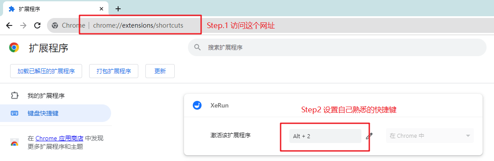

# 小鹅通工作小助手
1、该软件为免费使用软件，不对使用软件过程中出现任何问题负责，请自重。
2、若使用过程有任何建议或意见，请联系作者<a href="mailto:cnsasumi@outlook.com">cnsasumi@outlook.com</a>。

## 一、快速安装

### Chrome 浏览器如何安装自定义扩展

如果您使用的是谷歌浏览器（Chrome或者Chromium），可以使用以下步骤进行安装：
[1] 在浏览器地址栏中输入：chrome://extensions 后按回车，打开扩展程序管理页面。
[2] 点击页面上的按钮 【加载已解压的扩展程序】

[3] 选择扩展文件所在的文件夹，并确认

[4] 为方便使用，可以点击应用管理栏，常驻XeRun应用

### Microsoft Edge 浏览器如何安装自定义扩展

Microsoft Edge 浏览器核心使用 Chromium，因此在操作上与Chrome浏览器基本一致，部分按钮在界面上可能有变更，以Edge浏览器实际表现为准。

## 二、进阶使用
为更方便使用应用弹窗，建议设置快捷键打开该扩展应用。
chrome://extensions/shortcuts。

## 三、保持定期更新
当前扩展为公司内部使用，尚未上架chrome和edge商店。使用时间超过一定时间浏览器可能会提示开发插件过期。
点击【2周后提示】，或重新移除和安装插件即可。
最新插件版本请访问：https://github.com/sasumi/xerun 获取。

如有需要，请支持开发者工作。

